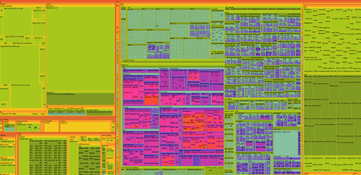

# This repository has been moved to [gitlab.com/paul-nechifor/space-hoarder](http://gitlab.com/paul-nechifor/space-hoarder).

Old readme:

# SpaceHoarder

A basic SpaceMonger clone for Linux written in Python with GTK+ 3.

## License

MIT
